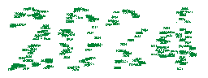

<!DOCTYPE html>
<html lang="es">
<head>
  <meta charset="UTF-8">
  <meta name="viewport" content="width=device-width, initial-scale=1, shrink-to-fit=no">
</head>
<body>

  

    

      

        

          
          

            <h5 class="card-title">¡Hola! Soy Nicolás Bermudez</h5>
            
Desarrollador apasionado por el motociclismo y el aprendizaje continuo.

            
Me encanta comunicarme con las personas para aprender algo nuevo.

            
Lenguajes de programación que domino:

            <ul>
              <li>Java</li>
              <li>JavaScript</li>
              <li>HTML</li>
              <li>CSS</li>
              <li>Node.js</li>
              <li>Angular</li>
              <li>React</li>
              <li>AWS</li>
              <li>C#</li>
            </ul>
          

        

      

    

  

</body>
</html>
